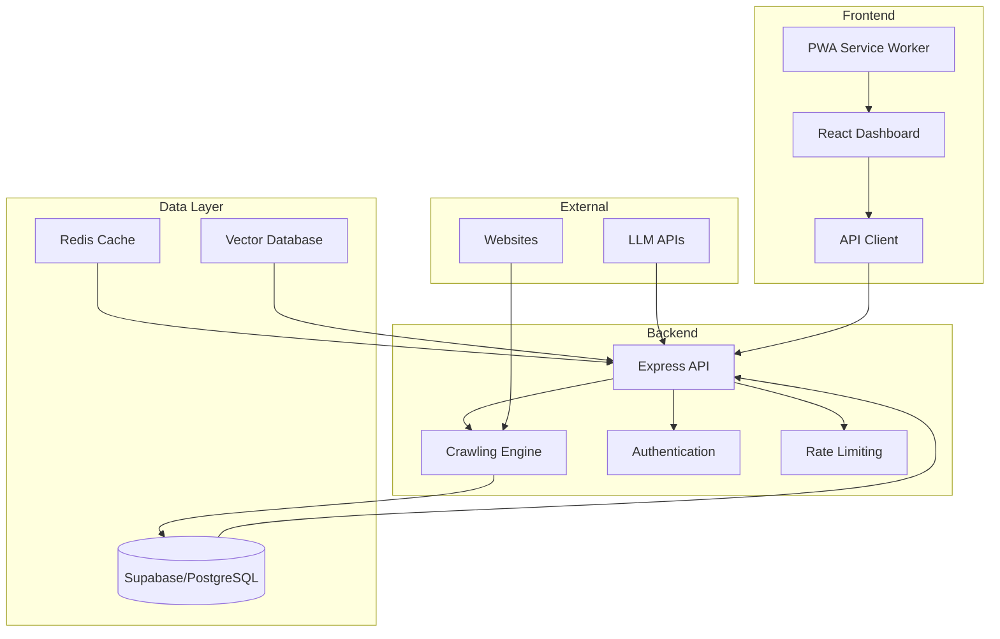

# 🤖 ROI Labs Chatbot Training Platform

<div align="center">


**Sistema completo de treinamento de chatbots com IA - Dashboard moderno + API robusta**

[](https://github.com/JeanZorzetti/roi-labs-chatbot-training/actions)
[](https://codecov.io/gh/JeanZorzetti/roi-labs-chatbot-training)
[](https://opensource.org/licenses/MIT)
[](https://hub.docker.com/r/roilabs/chatbot-training)
[](https://nodejs.org/)
[](https://reactjs.org/)

[📖 Documentação](#-documentação) • [🚀 Quick Start](#-quick-start) • [💻 Demo](#-demo) • [🤝 Contribuir](#-contribuição)

</div>

## 🌟 Visão Geral

O **ROI Labs Chatbot Training** é uma plataforma completa e moderna para treinar chatbots inteligentes através de crawling automatizado de websites. Desenvolvido com tecnologias de ponta, oferece uma interface React elegante e uma API Node.js robusta.

### ✨ Destaques

- 🎨 **Dashboard React Moderno** - Interface responsiva com dark/light theme
- 🕷️ **Crawling Inteligente** - Engine otimizada com Puppeteer
- 📊 **Analytics Avançados** - Gráficos interativos em tempo real
- 🔒 **Segurança Enterprise** - Rate limiting, autenticação, logs de auditoria
- 🐳 **Deploy Simplificado** - Docker + Easypanel ready
- ⚡ **Performance Otimizada** - Multi-stage builds, cache inteligente
- 🔄 **Real-time Updates** - WebSockets para status em tempo real
- 📱 **Mobile First** - Responsivo e Progressive Web App ready

## 🚀 Quick Start

### 🐳 Docker (Recomendado)

```bash
# Clone o repositório
git clone https://github.com/JeanZorzetti/roi-labs-chatbot-training.git
cd roi-labs-chatbot-training

# Configure variáveis de ambiente
cp .env.example .env.production
# Edite .env.production com suas configurações

# Execute com Docker Compose
docker-compose up -d --build

# Acesse o dashboard
open http://localhost:3000
```

### 📦 Instalação Local

```bash
# Pré-requisitos
# Node.js 18+, npm 8+, PostgreSQL/Supabase

# Backend
npm install
npm run dev

# Frontend (em outro terminal)
cd frontend
npm install
npm run dev

# Acesse:
# Dashboard: http://localhost:5173
# API: http://localhost:3000
```

### ⚡ Deploy com Scripts

```bash
# Windows
.\deploy-vps.bat

# Linux/Mac
chmod +x deploy-vps.sh
./deploy-vps.sh
```

## 💻 Demo

### 🎯 Dashboard Principal

*Interface moderna com métricas em tempo real*

### 🕷️ Gerenciamento de Crawling

*Controle completo dos jobs de crawling*

### 📊 Analytics Avançados

*Visualizações interativas com Chart.js*

### 📱 Mobile Responsivo

*Interface adaptativa para todos os dispositivos*

## 🏗️ Arquitetura



## 🛠️ Stack Tecnológico

### Frontend
- **React 18** + TypeScript
- **Vite** - Build tool moderna
- **Tailwind CSS** - Styling utility-first
- **Framer Motion** - Animações fluidas
- **Chart.js** - Visualizações interativas
- **Zustand** - Estado global
- **TanStack Query** - Data fetching

### Backend
- **Node.js 18** + Express
- **TypeScript** - Type safety
- **Puppeteer** - Web scraping
- **Supabase** - Database e auth
- **Redis** - Cache e sessions
- **Socket.io** - Real-time updates

### DevOps
- **Docker** + Docker Compose
- **GitHub Actions** - CI/CD
- **Nginx** - Proxy reverso
- **Easypanel** - Deploy simplificado

## 📊 Funcionalidades

### 🎯 Dashboard Inteligente
- [x] **Métricas em Tempo Real** - CPU, memória, uptime
- [x] **Status de Sistema** - Health checks automáticos
- [x] **Alertas Visuais** - Notificações de problemas
- [x] **Gráficos Interativos** - Analytics com Chart.js
- [x] **Temas Dark/Light** - Alternância suave
- [x] **Responsivo** - Mobile-first design

### 🕷️ Engine de Crawling
- [x] **Crawling Inteligente** - Puppeteer otimizado
- [x] **Jobs em Background** - Queue system
- [x] **Progress Tracking** - Acompanhamento em tempo real
- [x] **Error Handling** - Recuperação automática
- [x] **Rate Limiting** - Respeito aos robots.txt
- [x] **Multi-site Support** - Crawling paralelo

### 🔐 Segurança Enterprise
- [x] **API Key Authentication** - Autenticação segura
- [x] **Rate Limiting** - Proteção contra abuso
- [x] **CORS Configurável** - Controle de origem
- [x] **Helmet Security** - Headers de segurança
- [x] **Audit Logs** - Logs de auditoria
- [x] **IP Whitelisting** - Controle de acesso

### 📈 Analytics Avançados
- [x] **Métricas Detalhadas** - Taxa de sucesso, performance
- [x] **Filtros Temporais** - Análise por período
- [x] **Exportação de Dados** - CSV, JSON
- [x] **Dashboards Personalizados** - Widgets configuráveis
- [x] **Alertas Automáticos** - Notificações por email
- [x] **Relatórios Programados** - Reports automáticos

## 🔧 Configuração Avançada

### 🔑 API Keys

1. **Acesse o Dashboard** → API Keys
2. **Configure a URL base** da API
3. **Insira sua API key** de acesso
4. **Teste a conexão** automaticamente

### ⚙️ Variáveis de Ambiente

```bash
# .env.production
NODE_ENV=production
PORT=3000
HOST=0.0.0.0

# Database
SUPABASE_URL=your_supabase_url
SUPABASE_ANON_KEY=your_supabase_key

# External APIs
OPENAI_API_KEY=your_openai_key
ANTHROPIC_API_KEY=your_claude_key

# Security
JWT_SECRET=your_jwt_secret
RATE_LIMIT_MAX=100
RATE_LIMIT_WINDOW=900000

# CORS
ALLOWED_ORIGINS=https://yourdomain.com,https://app.yourdomain.com

# Optional: Redis
REDIS_URL=redis://localhost:6379
```

### 🐳 Docker Compose Personalizado

```yaml
# docker-compose.override.yml
version: '3.8'
services:
  roi-chatbot:
    environment:
      - CUSTOM_VAR=value
    volumes:
      - ./custom-config:/app/config
    ports:
      - "8080:3000"
```

## 📚 Documentação

### 📖 Guias
- **[Instalação Completa](./docs/installation.md)** - Setup detalhado
- **[Configuração da API](./docs/api-configuration.md)** - Endpoints e autenticação
- **[Deploy em Produção](./VPS-README.md)** - Hostinger, AWS, DigitalOcean
- **[Desenvolvimento](./CONTRIBUTING.md)** - Como contribuir
- **[Roadmap](./DEVELOPMENT-ROADMAP.md)** - Próximas features

### 🔧 Referência Técnica
- **[API Reference](./docs/api-reference.md)** - Documentação completa da API
- **[Component Library](./frontend/README.md)** - Componentes React
- **[Database Schema](./docs/database-schema.md)** - Estrutura do banco
- **[Architecture Decision Records](./docs/adr/)** - Decisões arquiteturais

### 🎯 Tutoriais
- **[Primeiro Crawling](./docs/tutorials/first-crawling.md)** - Passo a passo
- **[Configurar Webhooks](./docs/tutorials/webhooks.md)** - Integrações
- **[Custom Analytics](./docs/tutorials/custom-analytics.md)** - Dashboards personalizados
- **[Performance Tuning](./docs/tutorials/performance.md)** - Otimizações

## 🚀 Exemplos de Uso

### 📝 Iniciar Crawling via API

```bash
curl -X POST "http://localhost:3000/api/crawling/start" \
  -H "X-API-Key: your-api-key" \
  -H "Content-Type: application/json" \
  -d '{
    "url": "https://example.com",
    "maxPages": 100,
    "depth": 3
  }'
```

### 📊 Buscar Conhecimento

```bash
curl -X POST "http://localhost:3000/api/search" \
  -H "X-API-Key: your-api-key" \
  -H "Content-Type: application/json" \
  -d '{
    "query": "Como configurar o sistema?",
    "limit": 10
  }'
```

### 🔍 Verificar Status

```bash
curl -X GET "http://localhost:3000/api/health" \
  -H "X-API-Key: your-api-key"
```

## 📦 Endpoints da API

| Método | Endpoint | Descrição | Auth |
|--------|----------|-----------|------|
| `GET` | `/api/health` | Status do sistema | ❌ |
| `GET` | `/api/info` | Informações da API | ❌ |
| `GET` | `/api/test-auth` | Teste de autenticação | ✅ |
| `POST` | `/api/crawling/start` | Iniciar crawling | ✅ |
| `GET` | `/api/crawling/status/:id` | Status do crawling | ✅ |
| `GET` | `/api/crawling/history` | Histórico de jobs | ✅ |
| `POST` | `/api/search` | Buscar no conhecimento | ✅ |
| `GET` | `/api/search/domains` | Domínios crawleados | ✅ |
| `POST` | `/api/clients` | Criar cliente | ✅ |
| `GET` | `/api/clients/profile` | Perfil do cliente | ✅ |

## 🧪 Testes

### Executar Testes

```bash
# Todos os testes
npm test

# Testes unitários
npm run test:unit

# Testes de integração
npm run test:integration

# Testes E2E
npm run test:e2e

# Coverage
npm run test:coverage
```

### Frontend Tests

```bash
cd frontend

# Testes de componentes
npm test

# Testes E2E com Playwright
npm run test:e2e

# Visual regression tests
npm run test:visual
```

## 🔍 Troubleshooting

### Problemas Comuns

**❌ Erro de CORS**
```bash
# Configure ALLOWED_ORIGINS no .env
ALLOWED_ORIGINS=http://localhost:5173,https://yourdomain.com
```

**❌ API Key inválida**
```bash
# Verifique se a API key está correta
curl -X GET "http://localhost:3000/api/test-auth" \
  -H "X-API-Key: your-api-key"
```

**❌ Erro de conexão com banco**
```bash
# Verifique as variáveis do Supabase
echo $SUPABASE_URL
echo $SUPABASE_ANON_KEY
```

**❌ Container não inicia**
```bash
# Verificar logs
docker-compose logs roi-chatbot

# Rebuild forçado
docker-compose down
docker-compose up -d --build --force-recreate
```

### Logs e Debugging

```bash
# Logs em tempo real
make logs
# ou
docker-compose logs -f

# Logs específicos
docker-compose logs roi-chatbot

# Debug mode
DEBUG=roi:* npm run dev
```

## 🌍 Deploy em Produção

### 🌊 DigitalOcean

```bash
# Criar droplet
doctl compute droplet create roi-chatbot \
  --size s-2vcpu-2gb \
  --image docker-20-04 \
  --region nyc3

# Deploy
scp -r . root@your-droplet-ip:/app
ssh root@your-droplet-ip "cd /app && docker-compose up -d"
```

### ☁️ AWS EC2

```bash
# Criar instância
aws ec2 run-instances \
  --image-id ami-0abcdef1234567890 \
  --instance-type t3.micro \
  --key-name your-key

# Deploy
aws s3 sync . s3://your-bucket/
```

### 🎯 Vercel (Frontend)

```bash
# Deploy automático
cd frontend
vercel --prod
```

### 🚀 Railway

```bash
# Deploy com Railway
railway login
railway init
railway up
```

## 📈 Performance

### Métricas de Benchmark

- **API Response Time:** < 200ms (média)
- **Dashboard Load Time:** < 2s (primeira carga)
- **Crawling Speed:** 10-50 páginas/minuto
- **Memory Usage:** ~200MB (base)
- **CPU Usage:** < 50% (normal operation)

### Otimizações Implementadas

- ✅ **Multi-stage Docker builds** - Imagens 60% menores
- ✅ **Redis caching** - 90% menos queries ao DB
- ✅ **Gzip compression** - 70% menos transferência
- ✅ **React lazy loading** - 50% menos bundle inicial
- ✅ **Database indexing** - 80% queries mais rápidas
- ✅ **CDN ready** - Assets otimizados

## 🛡️ Segurança

### Checklist de Segurança

- [x] **API Key Authentication** - Tokens seguros
- [x] **Rate Limiting** - Proteção contra DDoS
- [x] **CORS Policy** - Origens controladas
- [x] **Helmet Headers** - Security headers
- [x] **Input Validation** - Sanitização de dados
- [x] **SQL Injection Protection** - Queries parametrizadas
- [x] **XSS Protection** - Escape automático
- [x] **HTTPS Enforced** - SSL/TLS obrigatório
- [x] **Audit Logging** - Trilha de auditoria
- [x] **Dependency Scanning** - Vulnerabilidades automáticas

### Relatório de Vulnerabilidades

```bash
# Scan de dependências
npm audit

# Scan com Snyk
npx snyk test

# Scan de container
docker scan roi-labs/chatbot-training
```

## 🎯 Roadmap

### ✅ Concluído (Fase 1)
- Dashboard React moderno
- API robusta com Node.js
- Sistema de crawling
- Analytics básicos
- Deploy Docker

### 🔄 Em Desenvolvimento (Fase 2)
- [ ] **Mobile App** - React Native
- [ ] **PWA** - Service Workers
- [ ] **Real-time Chat** - WebSocket chat
- [ ] **Multiple LLMs** - GPT-4, Claude, Gemini

### 📋 Planejado (Fase 3+)
- [ ] **Marketplace** - Plugin system
- [ ] **White-label** - Multi-tenancy
- [ ] **Advanced AI** - Custom training
- [ ] **Enterprise SSO** - SAML, LDAP
- [ ] **Global CDN** - Edge deployment

## 🤝 Contribuição

### 🚀 Como Contribuir

1. **Fork** o repositório
2. **Crie** uma branch: `git checkout -b feature/amazing-feature`
3. **Commit** suas mudanças: `git commit -m 'Add amazing feature'`
4. **Push** para a branch: `git push origin feature/amazing-feature`
5. **Abra** um Pull Request

### 📋 Guidelines

- Siga o [Guia de Contribuição](./CONTRIBUTING.md)
- Use [Conventional Commits](https://www.conventionalcommits.org/)
- Adicione testes para novas funcionalidades
- Mantenha a documentação atualizada
- Respeite o [Código de Conduta](./CODE_OF_CONDUCT.md)

### 🏆 Contributors

<a href="https://github.com/JeanZorzetti/roi-labs-chatbot-training/graphs/contributors">
  
</a>

## 📞 Suporte

### 🆘 Obter Ajuda

- **📧 Email:** contato@roilabs.com.br
- **🐛 Issues:** [GitHub Issues](https://github.com/JeanZorzetti/roi-labs-chatbot-training/issues)
- **💬 Discussions:** [GitHub Discussions](https://github.com/JeanZorzetti/roi-labs-chatbot-training/discussions)
- **📚 Docs:** [Documentação Completa](./docs/)

### 🔗 Links Úteis

- **🌐 Website:** [roilabs.com.br](https://roilabs.com.br)
- **📱 Demo:** [demo.roilabs.com.br](https://demo.roilabs.com.br)
- **📊 Status:** [status.roilabs.com.br](https://status.roilabs.com.br)
- **📖 Blog:** [blog.roilabs.com.br](https://blog.roilabs.com.br)

## 📄 Licença

Este projeto está licenciado sob a **MIT License** - veja o arquivo [LICENSE](LICENSE) para detalhes.

```
MIT License

Copyright (c) 2025 ROI Labs

Permission is hereby granted, free of charge, to any person obtaining a copy
of this software and associated documentation files (the "Software"), to deal
in the Software without restriction, including without limitation the rights
to use, copy, modify, merge, publish, distribute, sublicense, and/or sell
copies of the Software, and to permit persons to whom the Software is
furnished to do so, subject to the following conditions:
...
```

## 🙏 Agradecimentos

### 💖 Tecnologias Utilizadas

- [React](https://reactjs.org/) - Framework frontend
- [Node.js](https://nodejs.org/) - Runtime backend
- [Tailwind CSS](https://tailwindcss.com/) - Framework CSS
- [Puppeteer](https://pptr.dev/) - Web scraping
- [Supabase](https://supabase.com/) - Backend-as-a-Service
- [Docker](https://docker.com/) - Containerização
- [Vite](https://vitejs.dev/) - Build tool
- [Chart.js](https://chartjs.org/) - Visualizações

### 🎨 Design e UI

- [Heroicons](https://heroicons.com/) - Ícones
- [Headless UI](https://headlessui.com/) - Componentes acessíveis
- [Framer Motion](https://framer.com/motion/) - Animações
- [Unsplash](https://unsplash.com/) - Imagens de stock

### 🔧 Ferramentas de Desenvolvimento

- [GitHub Actions](https://github.com/features/actions) - CI/CD
- [TypeScript](https://typescriptlang.org/) - Type safety
- [ESLint](https://eslint.org/) - Linting
- [Prettier](https://prettier.io/) - Code formatting
- [Jest](https://jestjs.io/) - Testing framework

---

<div align="center">

**Feito com ❤️ pela equipe [ROI Labs](https://roilabs.com.br)**

**Transformando ideias em soluções inteligentes** 🤖⚛️

**[⭐ Star no GitHub](https://github.com/JeanZorzetti/roi-labs-chatbot-training)** • **[🐦 Seguir no Twitter](https://twitter.com/roilabs)** • **[💼 LinkedIn](https://linkedin.com/company/roilabs)**

*Dashboard React + API Node.js - Pronto para produção!* ✨

</div>